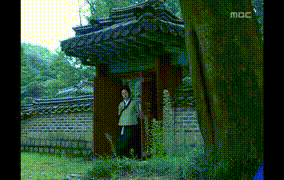

# ESRGAN_video_tf  
화질 개선 기법인 ESRGAN을 영상에 적용하기 위해 tensorflow로 코드 작성함  
참고 코드: https://www.tensorflow.org/hub/tutorials/image_enhancing?hl=ko
영상 출처: https://www.youtube.com/watch?v=Z1HbFOQ201w&t=15s

## 주요 변수명  
- hr: 원본 이미지  
- lr: downsampling된 결과  
- sr1: lr을 화질 개선한 결과  
- sr2: hr을 화질 개선한 결과  

## 사용자 설정 부분
- video_path: 화질 개선할 영상(hr) 위치  
- lr_path: downsampling된 영상(lr) 위치  
- sr1_path:  lr을 화질 개선한 영상(sr1) 위치  
- sr2_path: hr을 화질 개선한 영상(sr2) 위치  

## 적용 결과
{: width="100%" height="100%"}
{: width="50%" height="50%"}
